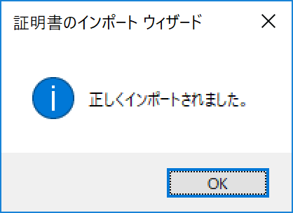
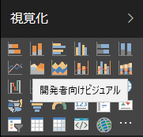

# R + Plotly における Power BI カスタムビジュアルの作成方法

Power BI では組み込みのビジュアルを使用してデータの可視化を簡単に行えるが一つの利点ですが、 **「カスタム ビジュアル」** という機能で簡単にサードパーティ（Microsoft 製含む）のビジュアルや独自のビジュアルを組み込むことが可能です。
この機能によりビジュアル「だけ」作成することはもちろん、R のプロット機能、または R + Plotly のプロット機能を使ったオリジナルの **「アナリティクス＋ビジュアル」** を作成して使用することも可能になります。

ここでは全く初めて作成する方を対象に、R + Plotly 環境におけるカスタム ビジュアルの作成方法について、順を追って説明いたします。

## 1. R と Plotly

R についてはご存知の方も多いかと思いますが、基本的にはターミナル画面で実行する記述統計、予測分析、機械学習を行うための言語環境です。R の大きな特徴として、パッケージと呼ばれる命令セットの中に上記のような統計、機械学習機能の他に、データや予測結果データの可視化を行う 「plot」（本体に付属）や「ggplot2」（ggplot）と呼ばれる可視化パッケージがあります。plot も ggplot も Power BI の「R スクリプト ビジュアル」から直接実行することができ、ちゃんと Power BI のフィルタやスケールの機能にも対応するので、非常に柔軟で強力な可視化を利用することが可能です。  
しかし強力である反面、ggplot では非常に複雑な書式が要求され、また ggplot は静的な可視化機能になるため、グラフ内でのデータ絞り込みやドリルダウンのようなインタラクティブな機能や、グラフの一部を拡大するなどの可視化支援機能は利用できません。

そこで新たな可視化環境として「Plotly」という可視化ライブラリが登場しました。Plotly は当初有償のフレームワークとライブラリで構成されておりましたが、現在ではクラウド環境を利用しないライブラリについては無償で提供されています。
この Plotly を利用することで、非常に単純な書式で複雑なグラフを作成することが可能です。またライブラリのみでインタラクティブ機能、リアルタイム描画機能が利用できるため、ユーザーの様々な要求に応えることが可能です。  
このように良い部分が多い Plotly ですが一つだけ弱点があり、Plotly は基本的に Web 画面での描画を想定しているため、 Power BI の R スクリプト機能ではそのまま利用することができません。そこで Power BI のカスタム ビジュアル機能の一つである RHTML というテンプレートを利用し、ビジュアルの成果物を Web ファイルに出力することで対応することになります。

Rについての日本語での解説は [こちら](http://www.okadajp.org/RWiki/?R%E3%81%A8%E3%81%AF) のページをご覧ください。このページは R の黎明期から利用されている有志による日本語解説サイトです。また Plotly については [こちら](https://plot.ly/r/) のページに詳細が説明されています。

## 2. 作業の流れ

作業の流れを簡単に追ってみましょう。

「3. 事前準備」  
ここでは Node.js や Node.js での Power BI のカスタムビジュアルを作成する上でのツール「pbiviz」のインストール、パッケージをPower BI にインストールする際に必要になる証明書の作成、インストールを行います。

「4. カスタム ビジュアル プロジェクトの作成」  
カスタム ビジュアルを作成するには、上記の pbiviz というツールを使って「カスタム ビジュアル プロジェクト」というファイルセットを作成する必要があります。ここで初めて R のスクリプトが登場します。

「5. カスタム ビジュアル の作成」  
ここでいよいよカスタム ビジュアルを作成します。R、Plotly でのスクリプトを記述後、Power BI Service でのテスト方法、エラーハンドリング、パッケージの作成、インストール方法を説明します。

一度環境が出来てしまえば、以下の流れで簡単にパッケージを作成することが可能です。

1. pbibiz new でのプロジェクトの作成
2. R 及び Plotly によるコードの記述
3. pbiviz start によるビジュアル サーバーの起動
4. Power BI Service でのテスト実施
5. pbiviz package によるパッケージに作成
6. パッケージのインストール

## 3. 事前準備
カスタム ビジュアルを作成する前に、作成に必要なものを整理しましょう。作成には以下の環境が必要となります。

1. Node.js (LTSバージョン)
2. Github上の「Power BI Visuals」の4手順

### Node.jsのインストール
Node.jsは[ここ](https://nodejs.org/ja/)からダウンロードできます。
2018年6月19日現在、LTS版の最新バージョンは「8.11.3 LTS」ですが、新しいものが出ている場合にはそちらをご利用ください。
インストール自体は msi パッケージですのでダブルクリックで開き、ウィザード形式でインストールが可能です。
詳細な手順が必要な方はWebで検索して実施してみてください。

### Github上の「Power BI Custom Visual」の4手順
Power BI 側の順として、Microsoft が Github 上で公開している「[Power BI Visuals](https://github.com/Microsoft/PowerBI-visuals)」というリポジトリの説明にある、「[Setting Up Environment](https://github.com/Microsoft/PowerBI-visuals#setting-up-environmen)」の内容を実行する必要があります。ここではこの項目の中にある 1 から 4項

1. Install PowerBI visuals CLI tool
2. Create SSL certifications to enable live preview of visuals
3. Install generated SSL certifications to enable live preview of visuals
4. Enable Developer Tools in PowerBI

までを実行する必要がありますので、日本語の簡単な説明を以下に記載します。

---

1. Power BI visuals CLI ツールのインストール
コマンドプロンプトを開き、npm コマンドでインストールを実行します。

`npm install -g powerbi-visuals-tools`

特にエラーも表示されず、以下のように導入したパッケージの数が表示されれば問題ありません（数は環境によって変動します）。

`added 836 packages in 190.126s`

引き続き稼働確認を行います。以下のコマンドを実行してください。

`pbiviz`

画面にPower BIのアスキーアート ロゴが表示されれば稼働確認は完了です（日本語コンソールの場合は変なロゴになります）。

---

2. ライブプレビュー用の SSL 証明書の作成

Windows 8 以降の方は下記コマンドを実行することで証明書の作成が完了ですが、Windows 7 の方は別途 OpenSSL のパッケージを完了させてから実行してください。

`pbiviz --create-cert`

完了すると以下のような結果が表示されます(<>内は環境依存です)。

```
 info   Certificate generated. Location is C:\Users\<UserName>\AppData\Roaming\npm\node_modules\powerbi-visuals-tools\certs\PowerBICustomVisualTest_public.pfx. Passphrase is '<PassPhrase>'
 ```

---

3. ライブプレビュー用に生成した SSL 証明書のインストール

続けて先ほど作成した証明書をインストールします。ここでは Windows での例を取り上げますので、その他の環境の方は [HTTPS Certificate Setup](https://github.com/Microsoft/PowerBI-visuals/blob/master/tools/CertificateSetup.md) のページを参考に実行してください。

最初に以下のコマンドを実行します。

`pbiviz --install-cert`

コマンドの実行が成功するとコマンド プロンプトに以下の内容が出力され、別画面で「証明書のインポート ウィザード」が表示されます。

` info   Use '<PassPhrase>' passphrase to install PFX certificate.`

このパスフレーズは次の手順で必要になりますので、メモしておいてください。
実行が完了すると以下のGUIが表示されます。「現在のユーザー」が選択されていることを確認し、「次へ」をクリックします。


この画面は何も変更せずに「次へ」をクリックします。


秘密キーのパスワードが求められますので、先ほどのパスフレーズを「パスワード」欄に入力し、「次へ」をクリックします。


証明書ストアを指定するため「証明書をすべて次のストアに配置する」を選択し、「参照」をクリックします。


証明書ストア画面で「信頼されたルート証明機関」を選択し、「OK」をクリックします。


元の画面に戻るので「次へ」をクリックします。


確認画面が表示されるため「完了」をクリックします。


セキュリティ警告が表示されるので「はい」をクリックします。


完了画面が表示されますので「OK」をクリックします。



これで証明書のインストールは完了です。

---

4. Power BI Service内での「Developer Visual」の有効化

次は Power BI Service の画面で設定を変更します。

[ここ](https://app.powerbi.com/?noSignUpCheck=1) をクリックして Power BI Service の画面に移動します。

ダッシュボードが開いたら、「設定」（画面上部の歯車アイコン）をクリックします。


メニューが現れるので「設定」をクリックします。


設定画面の左ペインで「開発者」をクリックします。


「テスト用の開発者向けビジュアルを有効にする」にチェックを入れます。


これでカスタム ビジュアルを開発する上での設定は完了です。開発者向けビジュアルの稼働確認はVisual プロジェクトが無いと実行できないので、あとで実行します。

## 4. カスタム ビジュアル プロジェクトの作成

カスタム ビジュアルを作成するには「カスタム ビジュアル プロジェクト」というテンプレートによるファイル セットの作成が必要になります。例えば通常の（R を使用しない）カスタムビジュアルであれば、

`pbiviz new <プロジェクト名>`

で作成可能ですが、R ビジュアルの場合は、

`pbiviz new <プロジェクト名> -t rvisual`

というテンプレートを呼び出すオプションが必要になり、R + Plotly の場合には、

`pbiviz new <プロジェクト名> -t rhtml`

というテンプレートの呼び出しが必要になります。ここでは RHTML の例で順を追って説明します。

---

1. コマンド プロンプトを起動し、プロジェクトを作成するディレクトリ（プロジェクト用ディレクトリは自動作成されるので作成は不要です）に移動します。

---

2. 以下の Node.js コマンドを実行します。

`pbiviz new testViz -t rhtml`

実行が完了すると以下のように表示されます。

```
 info   Creating new visual
 info   Installing packages...
 info   Installed packages.
 done   Visual creation complete
  ```

---

3. 新しく作成されたディレクトリ（ここでは testViz ）に移動します。

`cd testViz`

---

4. 通常のカスタム ビジュアルはここでサーバー起動できるのですが、R (+ Plotly) の場合は事前にパッケージ化が必要になるので以下の内容を実行します。

`pbiviz package`

---

5. Visual Server を起動します。

`pbiviz start`

起動が成功すると以下のようなメッセージが表示され、待機状態になります。

```
 info   Building visual...
 done   build complete

 info   Starting server...
 info   Server listening on port 8080.
```

これで Power BI Service からカスタム ビジュアルを使用できるようになりました。
作成後のファイル構成は以下のようになっているはずです。

```cmd:dir
.api             
.npmignore       
.tmp             
.vscode          
assets           
capabilities.json
dependencies.json
node_modules     
package-lock.json
package.json     
pbiviz.json      
r_files          
script.r         
src              
style            
tsconfig.json    
tslint.json
```

この中にある `r_files` と `script.r` がカスタム ビジュアルで R を実行する上で重要になります。

---

6. Power BI Service で適当なデータからレポートを作成します。サンプルからデータを取得しても構いませんし、作成済みのデータがあればそれを使用しても構いません。 

---

7. 空のレポートに対して下図にある「開発者向けビジュアル」をクリックします。



---

8. 問題なく動作すれば、下図のように Iris のデータがロードされた Plotly のグラフが表示されます。


データセットを Value の欄に入れてもグラフが変化しないのは、 Iris のデータがハードコードされているからですので不具合ではありません。

もし表示されない、エラーが出る、表示が異常な場合には以下の内容を疑うか、実行してみてください。

- 証明書の作成、インストールが不完全
- ブラウザのプライベートモードを使用してみる
- 違うブラウザを試してみる
- `pbiviz new` で作成する際に `-t` 以降を付与しないで作成する（あくまで動作するかのテストですので、実際には `-t` 以降は必要になります）

## 5. カスタム ビジュアルの作成

これでカスタム ビジュアルを作成する環境が整備されましたので、引き続き実際のデータを使って動作する、インタラクティブな R + Plotlyのグラフを開発します。
Rのコード作成を行うためにはエディタやIDEで開発を行いますが、ここでは Visual Studio Code（以下VCS）を使用して開発を行います。

---

1. VSCで 先ほど作成したプロジェクト内の script.r を開きます。以下のように表示されるはずです。

```
source('./r_files/flatten_HTML.r')

############### Library Declarations ###############
libraryRequireInstall("ggplot2");
libraryRequireInstall("plotly")
####################################################

################### Actual code ####################
g = qplot(`Petal.Length`, data = iris, fill = `Species`, main = Sys.time());
####################################################

############# Create and save widget ###############
p = ggplotly(g);
internalSaveWidget(p, 'out.html');
####################################################
```

1行目はライブラリの読み込み用の「libraryRequireInstall」や HTML ファイルの生成用の「internalSaveWidget」関数などが含まれるファイルをソースとして参照している行です。

4, 5行目は ggplot2 と plotly を必要に応じてインストールするための記述です。ここまでの内容は特に編集不要な内容です。

9行目は実際のコードを記述する部分ですが、ここでは ggplot のクイック プロット機能を使用しています。

13, 14行目はウィジェット作成、保存とコメントに書いてありますが、ここで行っていることは、

- ggplot で作成したグラフオブジェクトを plotly 形式に変換して p に代入し、
- それをウィジェットとして out.html と共に保存
 
しているということになります。これは、通常 ggplot は静的なグラフしか作成できないのですが、これを Plotly を通すことで動的なグラフを実現しているということになります。

---

2. このまま ggplot + Plotly を使っても問題ありませんが、ここはシンプルに Plotly だけ使う方法を選択します。以下のようなコードに変更してみてください。

```
source('./r_files/flatten_HTML.r')

############### Library Declarations ###############
libraryRequireInstall("plotly")
####################################################

################### Actual code ####################
p = plot_ly(Values,
  x = Values[,1],
  y = Values[,2]
)
####################################################

############# Create and save widget ###############
internalSaveWidget(p, 'out.html');
####################################################
```

---

3. ggplot を使用しなくなるなるだけでかなりコードが綺麗になりました。この状態で一度ダッシュボード上の「ビジュアル コードの再読み込み」をクリックします。


---

4. 適当な数値データを「Values」の欄にドラッグ＆ドロップします。すると以下のような棒グラフが表示されます。


Plotlyには他にも様々なグラフスタイルがありますので、それを試してみましょう。ここでは以下のようにコードを変更して、ヒートマップを表示してみます。

```
source('./r_files/flatten_HTML.r')

############### Library Declarations ###############
libraryRequireInstall("plotly")
####################################################

################### Actual code ####################
p = plot_ly(Values,
  x = Values[,1],
  y = Values[,2],
  z = Values[,3],
  type = "heatmap"
)
####################################################

############# Create and save widget ###############
internalSaveWidget(p, 'out.html');
####################################################
```

---

5. 保存を実行すると先ほど起動した `pbiviz` のコンソール画面で以下のように変更を検知、自動ビルドが行われます。

```
 info   RScript change detected. Rebuilding...
 done   RScript build complete
 ```

 これは `pbiviz` サーバーが自動的に変更を検知してビルドすることで開発効率を高める仕組みです。もし動作しない場合には先ほどの `package` コマンドを手動で実行し、サーバーを再起動してください。

---

 6. ここでダッシュボード上の「ビジュアル コードの再読み込み」をクリックします。ここでは3個のデータが必要にも関わらず2個のデータ（先ほどの状態であれば）しかないため、「ランタイムエラー」が発生しています。


このエラーの対処方法は後ほど解説しますので、ここではもう一つの数値データを「Values」欄にドラッグ＆ドロップします。これで以下のように画面が変わるはずです。


---

 7. たった2行のコードを追加するだけで、簡単にグラフを変えることができました。しかし先ほどのエラーのように、3軸のデータが必要な場合にデータ数が少ないとエラーが表示されるのは問題ですので、以下のようなコードを追加してみましょう。

```
source('./r_files/flatten_HTML.r')

############### Library Declarations ###############
libraryRequireInstall("ggplot2")
libraryRequireInstall("plotly")
####################################################

####### Validate number of columns and rows ########
pbiWarning <- NULL
# filter out non-numeric columns and constant columns (Should be comment if not use column test)
# correctColumn <- function(someColumn) { is.numeric(someColumn) && length(unique(someColumn)) > 1 }
# useColumns <- sapply(Values,correctColumn)
# if(sum(useColumns) < ncol(Values))
#   pbiWarning <- "Filtered out non numeric columns and constant columns"
# 
# Values <- as.data.frame(Values[,useColumns])

# filter out < 2 columns and < 2 columns
columnCount <- ncol(Values)
rowCount <- nrow(Values)

if (rowCount < 2 || columnCount < 3) {
  pbiWarning <- paste(pbiWarning, "<br><br>", "Not enough input dimensions");

# Plot error message to ggplot and convert to Plotly
  gg = ggplot()
  gg = gg + labs (title = pbiWarning, caption = NULL) + theme_bw() +
    theme(plot.title=element_text(hjust = 0.5, size = 20),
          axis.title=element_text(size =  11),
          axis.text=element_text(size =  8),
          panel.border = element_blank())
  p <- plotly_build(gg)
  internalSaveWidget(p, 'out.html')
  quit()
}
####################################################

################### Actual code ####################
p = plot_ly(Values,
            x = Values[,1],
            y = Values[,2],
            z = Values[,3],
            type = "heatmap"
)
####################################################

############# Create and save widget ###############
internalSaveWidget(p, 'out.html')
####################################################
```

ここでは「ggplot」が再び登場しているのがお分かりかと思います。これは Power BI が最終出力をグラフのオブジェクトしか受け取らないことと、Plotlyの出力内容に関係しています。もしエラーメッセージをそのままテキストで出力できれば特に何も問題ないのですが、Power BI では受け付けてくれません。また Plotly は様々なグラフを簡単に出力するには非常に良いのですが、例えば今回のエラーのように軸やデータを何も表示せずにテキストのみを表示することはできません。そのため今回 ggplot で出力した内容を更に `plotly_build` を使用して Plotly 形式のグラフとして出力しています。
また R 標準の `plot` も、今回の RHTML 形式ではウィジェット保存ができないため、対応できません。
もちろん軸やその他が表示されてもいいので、コードをなるべくシンプルにしたい場合には `Plotly` で記述しても動作します。

今回はセクションとして Validate number of columns and rows というコメントの部分を追加し、この中にコードを書きました。ブロックとしては、

- エラーメッセージの初期化
- 数値カラム以外のカラムの削除とエラー表示設定
- 特定の数値以下の行、列をエラーとする
- エラーメッセージの出力

の4つで構成されています。今回は文字列カラムも使用するので2個目のブロックはコメント化しています。
3つ目のブロックで3カラム未満の場合をエラーとしています。これはヒートマップは3次元のデータを必要としているからです。もしこれがヒストグラムであれば1未満、散布図であれば2未満というようにパラメータを変更する必要があります。
最後のブロックで `quit()` でコードを終了させていることにも注意が必要です。もし終了しなかった場合、後続のコードが実行されるため、エラーが表示されることになります。

---

8. それではこのコードを保存し、自動コンバートされたことを確認し、グラフをリロードしてみましょう。リロードが成功すると、特に先ほどと変わらない画面が表示されますので、データを1つ取り除きます。グラフが再度読み込まれ、以下のような画面に変わるはずです。


---

9. 再び取り除いたデータを戻し、元通り動作することも確認します。


---

10. 動作確認が完了したら、このビジュアルをパッケージ化して Power BI Desktop でも使用できるようにしましょう。カスタム ビジュアルとしてちゃんと認識できるように、アイコンの設定をしましょう。カスタム ビジュアルで使用できるアイコンのサンプルが、

`assets\icon.png`

に配置されていますので、それを変更しましょう。ここでは以下のようなアイコンにしました。
アイコンのサイズは 20x20 と非常に小さいので注意しましょう。


同じ場所、同じ名前で png 形式で保存します。

---

11. 保存が完了したら、パッケージ化を行います。以下のコマンドを実行してパッケージを作成します。

`pbiviz package`

問題が無ければ、以下のように表示されて完了します。

```
 info   Building visual...
 done   packaging complete
```
---

12. パッケージ化されたファイルを確認しましょう。パッケージは以下の場所に格納されます。

`dist\<プロジェクト名>.pbiviz`

このファイルを Power BI Desktop で読み込み、動作を確認します。

---

13. Power BI Desktop を起動します。もしお持ちでない方は Power BI の製品ページからダウンロードしてください。起動後、「視覚化」メニューから「カスタム ビジュアルのインポート」アイコンをクリックします（・・・というアイコンです）。


---

14. メニューが開くので「ファイルからインポートする」をクリックします。「プライバシーに関するリスク」警告が表示される場合がありますので、内容を確認の上「インポート」をクリックします。


---

15. 先ほどパッケージ化したファイルを選びます。正常にインポートされると「正常にインポートされました」という内容のダイアログが表示されます。


---

16. 先ほど作成したアイコンでパッケージが追加されていることを確認します。


---

17. Power BI Service での動作確認時と同じ動作が行われるか確認します。


---

これで R と Plotly を使用したカスタム ビジュアルの作成は完了です。Microsoft 自体も様々な同様のカスタム ビジュアルを Github にて公開していますので、ビジュアル開発の一助にご利用頂ければと思います。

[Microsoft の Github リポジトリ （R を利用したカスタム ビジュアルのみ）](https://github.com/search?l=R&q=microsoft%2Fpowerbi-visuals-&type=Repositories)